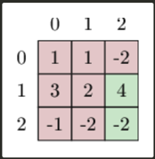
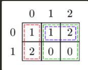

There is a matrix A of integers, consisting of R rows and C columns. 
Row are numbered from 0 to R-1; columns are numbered from 0 to C-1

Calculate the number of non-empty rectangular areas inside A, such that the sum of integers inside that area is equal to the sum of integers outside of it.

For example, for A =[[1,1,-2],[3,2,4],[-1,-2,-2]], one of such rectangular areas can be made of two cells with values 4 and -2, at position (1,2) and (2,2) (marked in green in the picture below).
Their sum is equal to 2, which is equal to the sum of the remaining integers in A (marked in red in the picture below).
There are six more other rectangular areas fulfilling the requirement in A.

Write a function:  
class Solution { public int solution(int[][] A); }

that, given a matrix A made of integers, returns the number of ways to pick a rectangular area as described above.

Examples:
1. For A = [[1,1,2],[2,0,0]], the function should return 3. The rectangular areas fulfilling the requirement are marked in colors in the picture below:

2. For A = [[5,-1],[-3,2],[0,4]], the function should return 0. There is no area fulfilling the requirement.
3. For A = [[1,1,-2],[3,2,4],[-1,-2,-2]], the function should return 7.
4. For A = [[-1,0],[1,0]], the function should return 5.

Assume that:
- R and C are integers within the range [1..30];
- the number of elements in matrix A is within the range [1..100];
- each element of matrix A is an integer within the range [-1,000,000,000..1,000,000,000].

In your solution, focus on correctness. The performance of your solution will not be the focus of the assessment.

